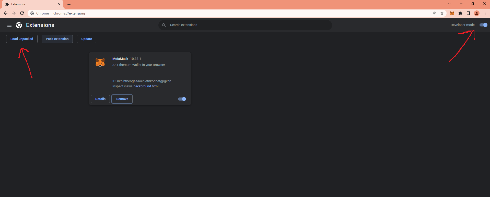
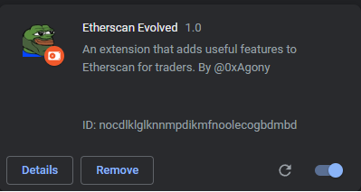

# Installation Instructions
Requirements: Chromium based browser (Chrome, Brave, Edge, Opera GX, etc.)

You will manually have to install updates until the extension is published on the Chrome Web Store.

### Steps

1. Verify the source code to ensure your safety.
2. Download as ZIP as shown in the image below.

3. Extract the ZIP file to a folder somewhere on your PC.
4. Open the manage extensions page of your browser.
5. Enable developer mode and click on "Load unpacked" as shown in the image below.

6. Select the folder you extracted the ZIP file to.
7. The extension should now show up as shown in the image below.

